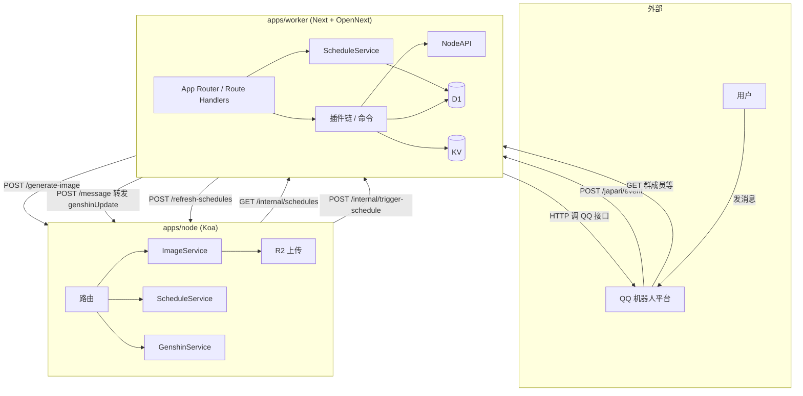

# japari-admin 整体架构设计

## 1. 概述

japari-admin 是基于 QQ 机器人的后台服务，采用 **Node + Cloudflare Worker** 双端分离的 monorepo：**Node** 负责图片生成（含 R2 上传）与定时任务调度，**Worker** 为 Next.js App Router + OpenNext 单 Worker，负责 QQ 事件、插件/命令、管理后台及 D1/KV 访问。两者通过 HTTP 内部接口协作。

## 2. 仓库结构（Monorepo）

```
japari-admin/
├── apps/
│   ├── node/              # Koa：图片生成 + 定时调度
│   │   ├── src/
│   │   │   ├── index.js, routes, config, services/, utils/, middlewares/
│   │   │   └── (SWC 构建到 built/)
│   │   ├── dockerfile     # 生产镜像，context 为 ./apps/node
│   │   └── package.json
│   │
│   └── worker/            # Next.js + OpenNext 单 Worker
│       ├── src/
│       │   ├── app/                   # Next App Router
│       │   │   ├── page.tsx, admin/, japari/, (layout, route handlers)
│       │   │   └── japari/event/route.ts, japari/message/route.ts
│       │   ├── actions/               # Server Actions（群配置、插件配置、模拟消息）
│       │   ├── lib/                   # auth, ensure-plugins
│       │   ├── plugins/               # 插件 + commands，@Plugin/@Command 装饰器
│       │   ├── services/              # D1, KV, QQ, PluginService...
│       │   ├── config.js              # getCloudflareContext().env
│       │   └── decorators/
│       ├── wrangler.toml              # 生产部署用（勿提交）
│       ├── wrangler.dev.toml          # 本地 preview 用
│       ├── .dev.vars                  # 本地环境变量（勿提交）
│       └── package.json
│
├── package.json           # workspaces; lint/format 委托到各 app
└── ARCHITECTURE.md
```

- **根目录**：`npm run worker:dev` / `npm run node:dev`、`npm run lint` / `npm run format`。
- **Node**：Koa，SWC 构建到 `built/`，运行 `node built/index.js`；Docker 最终阶段仅装生产依赖。
- **Worker**：Next.js 构建 + OpenNext 生成 `.open-next/worker.js`；配置与绑定统一通过 **getCloudflareContext().env**（无 env-store）；插件使用 SWC 装饰器（next.config 中配置）。

## 3. 整体架构图



## 4. Node 端（apps/node）

### 4.1 职责

- **图片生成**：hoshii、原神圣遗物图，上传 R2 返回 URL。
- **定时调度**：node-schedule 按 Worker 拉取的 schedule 列表注册，到点请求 Worker 发群消息。
- **原神缓存**：`POST /message`（genshinUpdate）更新 taffy 缓存。

### 4.2 路由与构建

| 方法 | 路径 | 说明 |
|------|------|------|
| GET | / | 占位 |
| POST | /generate-image | 生成图片并上传 R2 |
| POST | /refresh-schedules | 从 Worker 拉取 schedule 并重新注册 |
| POST | /message | 内部消息（如 genshinUpdate） |

- **配置**：复制 `config.example.json` 为 `config.json`，填写 `port`、`workerUrl`；R2 等用环境变量。
- **构建**：`npm run node:build`（SWC）→ 输出 `built/`。
- **运行**：`npm install && npm run build && npm start`（或在根目录 `npm run node:dev` / `npm run node:start`）。
- **Docker**：context 为 `./apps/node`，最终阶段 `npm install --omit=dev`，见 `apps/node/dockerfile`。

## 5. Worker 端（apps/worker）

### 5.1 职责

- **QQ 事件**：`POST /japari/event` 进入插件链（含 command-runner 解析 `!xxx`）。
- **管理后台**：Next 页面与 Server Actions；鉴权 Cookie `admin_token`（ADMIN_SECRET 或 KV session）。
- **插件/命令**：`plugins/` + 装饰器，PluginService 管理加载与群配置；**群插件配置存 KV**，首次需插件列表时调用 **ensurePluginsLoaded()**（getGroupConfig、getPluginConfig、japari/event、simulate 等）。
- **配置与绑定**：全部通过 **getCloudflareContext().env**（Config、D1Service、KVService 内部使用），无 env-store。

### 5.2 路由一览

| 类型 | 路径 | 说明 |
|------|------|------|
| 页面 | /, /admin, /admin/op, /admin/op/groups | 管理首页、超管、全部群 |
| 页面 | /admin/group/[groupId], /admin/group/.../plugin/[pluginName], /admin/group/.../simulate | 单群管理、插件配置、消息模拟 |
| 页面 | /admin/token/[token] | 一次性链接兑换（写 Cookie 后重定向） |
| API | POST /japari/event | QQ 事件上报，执行插件链 |
| API | POST /japari/message | 内部消息（如转发 genshinUpdate） |
| API | GET /internal/schedules | Node 拉取定时列表 |
| API | POST /internal/trigger-schedule | Node 到点触发 |

### 5.3 插件加载与配置

- **加载时机**：首次需要插件列表时执行 **ensurePluginsLoaded()**（在 getGroupConfig、getPluginConfig、japari/event、simulate 等入口），之后 PluginService.plugins 有数据。
- **群配置**：KV 存储；getGroupConfig 先 ensurePluginsLoaded，再读 KV 与插件列表供侧栏展示；插件开关通过 setGroupConfig 更新 KV。
- **插件配置页**：getPluginConfig/setPluginConfig 同样先 ensurePluginsLoaded，再按插件名查找并调用 getPageConfig/setPageConfig。

### 5.4 Worker 本地调试与部署

**方式一：Next 开发服务器（推荐日常开发）**

在 `apps/worker` 下：`npm install`、`npm run dev`（或根目录 `npm run worker:dev`）。使用 `next dev` + OpenNext 开发初始化，可访问本地模拟 D1/KV。前端默认 <http://localhost:3000>，管理后台 <http://localhost:3000/admin>，QQ 说明 <http://localhost:3000/japari>。环境变量与绑定：同目录 `.dev.vars`（`KEY=value` 每行一个），与 wrangler 配置中 `[vars]`、D1/KV 在本地会被模拟。

**方式二：本地 Worker 预览（与线上运行时一致）**

在 `apps/worker` 下：`npm run preview`。先 `opennextjs-cloudflare build` 生成 `.open-next/`，再以 Wrangler 启动（**使用 wrangler.dev.toml**，脚本已带 `--config wrangler.dev.toml`）。预览地址由 Wrangler 输出（通常 `http://localhost:8787`）。

**Wrangler 配置文件**

| 场景 | 使用的配置 | 说明 |
|------|------------|------|
| 本地预览 | `wrangler.dev.toml` | `npm run preview` 已写死 `--config wrangler.dev.toml` |
| 线上部署 | `wrangler.toml` | `npm run deploy` 使用默认文件名 |

`wrangler.toml`、`wrangler.dev.toml`、`.dev.vars` 均在 `.gitignore`，不提交；需本地或 CI 自建（从占位符复制后填写 D1/KV 的 database_id、id 等）。

**线上部署**

在 `apps/worker` 下：`npm run deploy`。会先 `opennextjs-cloudflare build`（内部跑 `next build`），再 `opennextjs-cloudflare deploy`。入口 `.open-next/worker.js`，静态资源 `.open-next/assets`（ASSETS 绑定）。绑定以 **wrangler.toml** 为准；敏感配置用 Cloudflare 控制台或 `wrangler secret`。

**构建与上传分离**（按需）：`npm run build` 仅 next build；`opennextjs-cloudflare build` 生成 .open-next/；`opennextjs-cloudflare upload` 仅上传版本；`opennextjs-cloudflare deploy` 构建+部署。

**环境与绑定**：vars = wrangler `[vars]` + `.dev.vars`（本地）/ 控制台或 Secrets（线上）。D1/KV 在 wrangler 中配置，本地预览用本地 SQLite/KV。管理鉴权需 `ADMIN_SECRET`、`ADMIN_BASE_URL` 等。

## 6. 配置与部署约定

| 端 | 配置来源 | 关键项 |
|----|----------|--------|
| Node | config.json + 环境变量 | port、workerUrl；R2_* |
| Worker | .dev.vars / wrangler [vars]；getCloudflareContext().env | QQ_SERVER、NODE_URL、ADMINS、BOT_QQ_ID、ADMIN_SECRET、ADMIN_BASE_URL；D1/KV 在 wrangler 绑定 |

**内部接口约定**：Node 调 Worker → `GET {workerUrl}/internal/schedules`、`POST {workerUrl}/internal/trigger-schedule`（body: `{ groupId }`）。Worker 在 schedule 相关命令或后台修改定时后调 Node → `POST {nodeUrl}/refresh-schedules`。

## 7. 核心数据流（与旧版一致）

- QQ 消息 → POST /japari/event → 插件链 → 命令/图片等 → Node 或 QQ。
- 定时：Node 拉 GET /internal/schedules，到点 POST /internal/trigger-schedule；用户改定时后 Worker 调 Node POST /refresh-schedules。
- 原神缓存：POST /japari/message 转发到 Node POST /message。

以上为当前 japari-admin 的整体架构，Worker 已迁移为 Next.js + OpenNext 单 Worker，配置与绑定统一走 getCloudflareContext。
