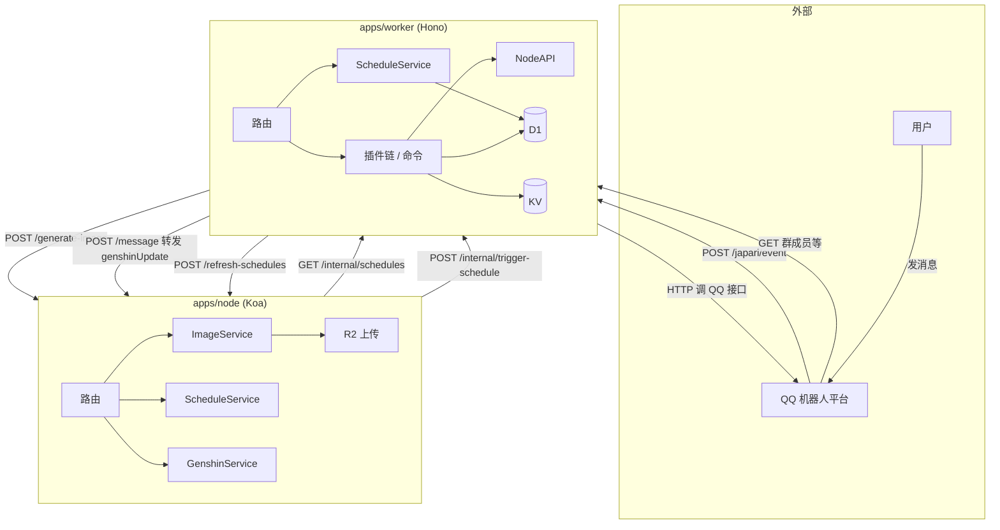
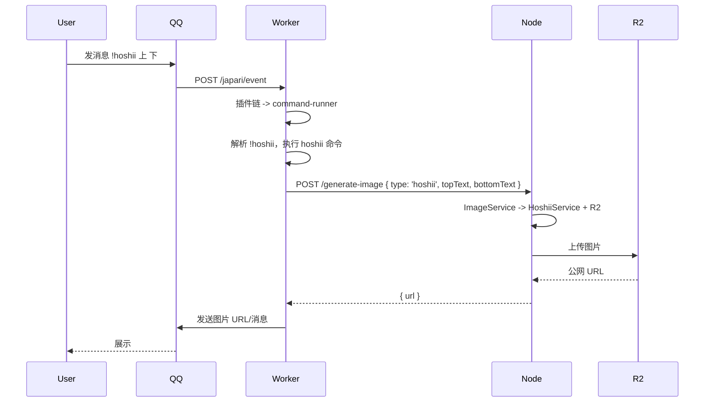
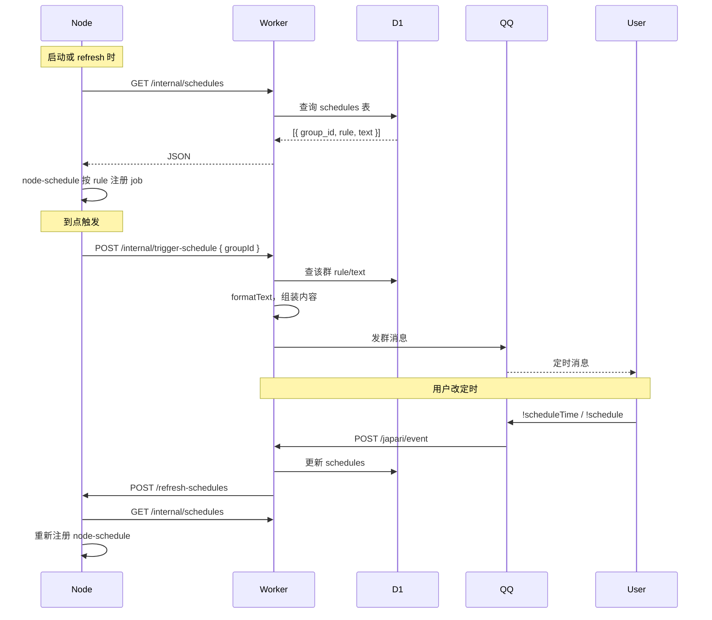
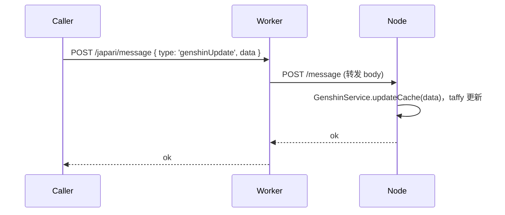
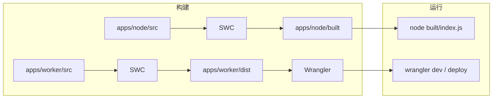

# japari-admin 整体架构设计

## 1. 概述

japari-admin 是一个基于 QQ 机器人的后台服务，采用 **Node + Cloudflare Worker** 双端分离的 monorepo 结构：**Node** 负责图片生成（含 R2 上传）与定时任务调度，**Worker** 负责 QQ 事件处理、插件/命令执行及 D1/KV 数据访问。两者通过 HTTP 内部接口协作，避免在 Worker 中依赖 Node 专有能力（如 canvas、taffy、fs）。

## 2. 仓库结构（Monorepo）

```
japari-admin/
├── apps/
│   ├── node/          # Koa 服务：图片生成 + 定时调度
│   │   ├── src/
│   │   │   ├── index.js
│   │   │   ├── routes.js
│   │   │   ├── config.js
│   │   │   ├── services/     # ImageService, ScheduleService, GenshinService, R2, Hoshii...
│   │   │   ├── utils/
│   │   │   └── middlewares/
│   │   ├── config.example.json
│   │   └── package.json
│   │
│   └── worker/         # Cloudflare Worker：Hono + D1/KV 绑定
│       ├── src/
│       │   ├── worker.js      # 入口，export default { fetch }
│       │   ├── routes.js      # Hono 路由
│       │   ├── config.js      # 从 env 读取
│       │   ├── env-store.js   # 请求级 env 注入
│       │   ├── plugins/       # 插件 + commands，静态 registry
│       │   ├── services/      # D1, KV, Schedule, QQ, NodeAPI...
│       │   ├── decorators/    # @Plugin, @Command
│       │   └── utils/
│       ├── wrangler.toml
│       ├── .dev.vars.example
│       └── package.json
│
├── package.json        # workspaces: apps/node, apps/worker
└── ARCHITECTURE.md
```

- **根目录**：npm workspaces，统一 lint/format，`npm run worker:dev` / `npm run node:dev` 委托到对应 app。
- **Node**：Koa + 手写路由，无 Controller/装饰器；构建用 SWC，输出 ESM。
- **Worker**：Hono，入口 `worker.js`；先 SWC 转译装饰器再 wrangler 打包，使用 D1/KV 绑定，配置仅来自 env。

## 3. 整体架构图



## 4. Node 端（apps/node）

### 4.1 职责

- **图片生成**：hoshii 表情包、原神角色圣遗物图，生成后上传 R2，返回公网 URL。
- **定时调度**：使用 `node-schedule` 按「从 Worker 拉取的 schedule 列表」注册 cron，到点只向 Worker 发起「发送该群定时消息」的请求，不直连 QQ。
- **原神缓存**：接收 `POST /message`（type: genshinUpdate），调用 taffy 的 updateCache，不依赖 Worker 的 fs/Node 环境。

### 4.2 路由一览

| 方法 | 路径 | 说明 |
|------|------|------|
| GET | / | 首页占位 |
| POST | /generate-image | 生成图片并上传 R2；body: `{ type: 'hoshii'\|'genshin', ...params }`，返回 `{ url }` |
| POST | /refresh-schedules | 从 Worker 拉取最新 schedule 并重新注册 node-schedule |
| POST | /message | 内部消息，如 genshinUpdate 时更新本地 taffy 缓存 |

### 4.3 技术栈与配置

- Koa、@koa/router、koa-body、node-schedule、@napi-rs/canvas、taffy-pvp-card-sw、@aws-sdk/client-s3（R2）。
- 配置：`config.json`（port、workerUrl）+ 环境变量（R2_*）。

## 5. Worker 端（apps/worker）

### 5.1 职责

- **QQ 事件**：接收 QQ 平台 POST `/japari/event`，按消息类型跑插件链（含 command-runner 解析 `!xxx` 命令）。
- **插件/命令**：静态 registry（`plugins/registry.js`、`plugins/commands/registry.js`），构建时打入 bundle；使用 @Plugin / @Command 装饰器（SWC 转译）。
- **数据**：D1 存 schedule、osu_bind、new_notice 等；KV 存群插件配置等；全部通过 **Worker 绑定**（env.DB、env.KV）访问，不走 HTTP API。
- **图片/原神**：不包含 canvas、taffy；hoshii/原神 命令通过 **NodeAPI** 请求 Node 的 `/generate-image`；原神缓存更新由 Worker `/japari/message` 转发到 Node `/message`。

### 5.2 路由一览

| 方法 | 路径 | 说明 |
|------|------|------|
| GET | / | 首页 |
| GET | /japari | ジャパリパーク 说明页 |
| POST | /japari/event | QQ 事件上报，执行插件链 |
| POST | /japari/message | 内部消息；genshinUpdate 时转发到 Node |
| GET | /internal/schedules | 供 Node 拉取全量 schedule 列表 |
| POST | /internal/trigger-schedule | 供 Node 到点触发；body: `{ groupId }`，Worker 查 D1 发 QQ |

### 5.3 技术栈与配置

- Hono、D1 绑定、KV 绑定、axios（调 QQ 与 Node）、fflate（替代 zlib）、ojsama、pino 等。
- 配置：仅 env（.dev.vars / wrangler [vars]），如 QQ_SERVER、NODE_URL、ADMINS、BOT_QQ_ID、OSU_APP_KEY 等。

## 6. 核心数据流

### 6.1 QQ 消息与图片生成



### 6.2 定时任务（Schedule）



### 6.3 原神缓存更新



## 7. 配置与部署约定

| 端 | 配置来源 | 关键项 |
|----|----------|--------|
| Node | config.json + 环境变量 | port、workerUrl；R2_ACCOUNT_ID、R2_ACCESS_KEY_ID、R2_SECRET_ACCESS_KEY、R2_BUCKET_NAME、R2_PUBLIC_DOMAIN |
| Worker | .dev.vars / wrangler vars | QQ_SERVER、NODE_URL、ADMINS、BOT_QQ_ID、OSU_APP_KEY、NET_EAST_MUSIC_SERVER；D1/KV 在 wrangler.toml 绑定 |

- **Node 调 Worker**：`workerUrl` + `/internal/schedules`、`/internal/trigger-schedule`。
- **Worker 调 Node**：`NODE_URL` + `/generate-image`、`/refresh-schedules`、`/message`（转发）。

## 8. 构建与运行



- **Node**：`npm run node:build`（SWC）→ `npm run node:start`（node built/index.js）。
- **Worker**：`npm run build -w japari-worker`（SWC 到 dist）→ `wrangler dev` / `wrangler deploy`（入口 dist/worker.js）。
- 根目录：`npm run worker:dev`、`npm run node:dev` 通过 workspaces 调用上述脚本。

以上为当前 japari-admin 的整体架构设计，Node 与 Worker 职责清晰，通过少量 HTTP 接口与 D1/KV 绑定协作，便于维护与扩展。
